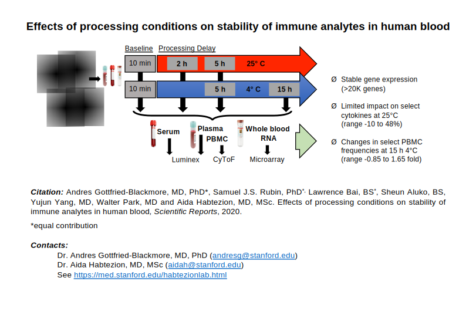

# Immuno-analyte Variance Estimation Tool [iVET] 

Access the live web application [here](https://immuno19.web.app/). 

## About this github repository 

This repository contains two main subdirectories, <b>src</b> and <b>raw_data</b>.  

<b>src: </b>
This directory contains all of the client side javascript code for building the web interface. iVET was developed using the [create react app tool](https://github.com/facebook/create-react-app), and thus
the source code is in javascript and react's jsx syntax.

<b>raw_data: </b>
This directory contains raw csv data files which were used to populate the cloud database that iVET queries during runtime. It also contains json files which define terminologies used by the application. 

## iVET Software Architecture 

Hosting: iVET is hosted using [Firebase](https://firebase.google.com/), a Google cloud product. 
Front End:  The frontend (website) was developed using the [create react app tool](https://github.com/facebook/create-react-app) and [semantic-ui react](https://react.semantic-ui.com/). 
Database: All experimental data is stored in a cloud database called [Firestore](https://firebase.google.com/docs/firestore), which is a database product within [Firebase](https://firebase.google.com/). When a user enters a query, the iVET front end application queries this cloud database for the relevant experimental data and then graphs it. 

